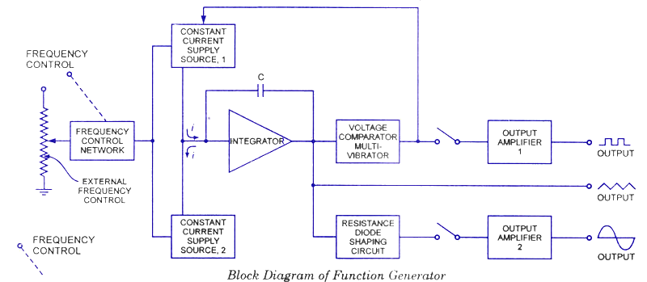
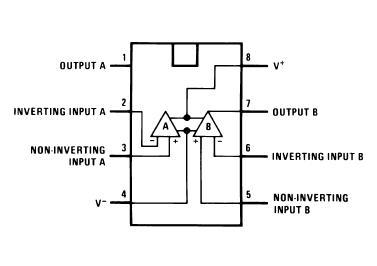

### Introduction
 
The function generator consists of a comparator U1 and an integrator A2.The comparator U2 compares the voltage at point P continuously with the inverting input i.e., at zero volts. When voltage at P goes slightly below or above zero volts, the output of U1 is at the negative or positive saturation level, respectively. To illustrate the circuit operation let us set the output of U1 at positive saturation +Vsat (approximately +Vcc). This +Vsat is an input to the integrator U2.
 The output of U2, therefore will be a negative going ramp. Thus, one end of the voltage divider R2-R3 is the positive saturation voltage +Vast of U1 and the other is the negative going ramp of U2. When the negative going ramp attains a certain value –Vramp, point p is slightly below zero valts; hence the output of U1 will switch from positive saturation to negative saturation –Vsat (approximately –Vcc). 
 
This means that the output of U2 will now stop going negatively and will begin to go positively. The output of U2 will continue to increase until it reaches +Vramp. At this
time the point P is slightly above zero volts. The sequence then repeats. The frequencies of the square are a function of the d.c supply voltage. Desired amplitude can be obtained by using approximate zeners at the output of U1.
 

  

<b>Figure 1. Function Generator</b>

  

 

<b>Figure 2. Pin diagram of IC LM1458</b> 
