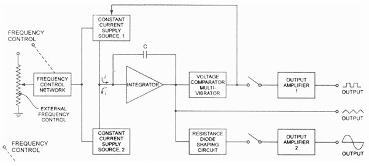
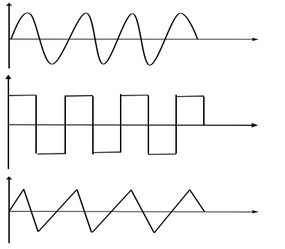
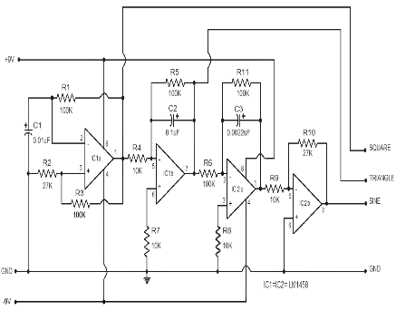

<h2>Introduction</h2>

Function Generator is an instrument that can generate common waveforms like triangle, sine, cosine, square, sawtooth, etc., It also provides options for changing the characteristics of the waveforms such as amplitude and frequency. The wave generated is available at the output jack. It can be visualised by connecting it to the CRO.The waveforms of these frequencies may be adjusted from hertz to a hundred kHz. This generator is considered as the most versatile instrument in the electrical and electronics laboratory because the waveforms generated by this generator have applications in different areas.

### Function Generator Block Diagram

The block diagram of function generator contains various components they are frequency control network, constant current supply source 1, constant current supply source 2, integrator, voltage comparator multivibrator, capacitor, a resistance diode shaping circuit, and two output amplifiers. The block diagram of this generator is shown in the below figure.

Fig.1 Function Generator Block Diagram
 

The frequencies can be controlled by varying the current magnitude. The two constant-current supplies will change the frequency of the output signal. The output waveforms generated by this generator are sinusoidal, triangular, and square. The frequency range of these waveforms ranges from 0.01 Hz to 100 kHz. The frequency control network controls the frequency on the front panel of this generator, and there is a knob called frequency control. The frequency of the o/p waveforms can be changed by using this knob & varying the frequency.

The frequency control network provides the voltage, and this voltage goes to regulate the two constant current supply sources like upper and lower. The first output voltage of constant current supply can be increased linearly with the time, whereas the lower current source provides a voltage to change the output voltage of the integrator which will decrease linearly with time. The output voltage of the integrator due to the upper current source is expressed.

When the slope of the o/p voltage increases or decreases then the constant current supply source 1 will be increases or decreases. The lower constant current source two supplies reverse control to the integrator, and due to this reverse current, the output voltage of the integrator decreases linearly with the time. The output of the comparator provides a square wave which has the same frequency as the output voltage. The resistance diode network changes the triangle waveform slope as its amplitude produces and changes a sine waveform with a <1% distortion. The output waveforms of this generator are shown below.

Fig.2 Output Waveforms of Function Generator
 

### Function Generator using op-amp LM1458

A simple function generator circuit using LM1458 is known here. LM1458 is a dual general purpose operational amplifier. The two opamps inside LM1458 has a common bias network, power supply line and are independent of each other in operation. The LM1458 does not require an external frequency compensation circuit and has built in short circuit protection. Lm 1458 has a wide supply voltage range and it is available in 8 pin mini DIP package. 

Fig.3 Function Generator using IC LM1458
 

Four op-amps (2 from each IC) is used in the function generator circuit. First opamp IC 1a is wired as an astable multivibrator.R1 is the feedback resistor and C1 is the timing capacitor output of IC 1a is feed back to its non inverting input (pin 3) from the junction of R3 & R2.The output of IC 1a will be a square wave and its frequency can be varied by varying R1 or C1.  

The next opamp IC 1b is wired as an integrator.R5 is the feedback resistor and C2 is the integrating capacitor. Non inverting input of IC 1b (pin6) is tied to ground using resistor R7. The output of IC 1a which is a square wave is applied to the inverting input of IC 1b (pin 5) through R4 which is the input resistance of IC 1b.The output of IC 1b will be a triangular wave form, because integrating a square wave will result in a triangular waveform. 

IC 2a forms another integrator, where R11 is its feedback resistor and C3 is the integrating capacitor.R6 is the input resistance of IC 2a. Non inverting input of IC 2a (pin 3) is tied to ground using the 10K resistor R8. IC 2b forms an inverting amplifier where R9 is its input resistor and R10 the feedback resistor. With the used values of R10 and R9, the gain of the inverting amplifier stage will be 27, (AV = -Rf/Rin). The triangular output waveform from the IC 1b is further integrated using IC 2a inverter using IC 2b circuit diagram.

### Applications of Function Generator

1. Function generators are used for calculating the BPF frequency response.
2. For testing the delay margin.
3. Analyze the audio DAC.
4. To test clock frequency functional range of digital circuits.
5. Analyze switching signals of IGBT circuitry.

